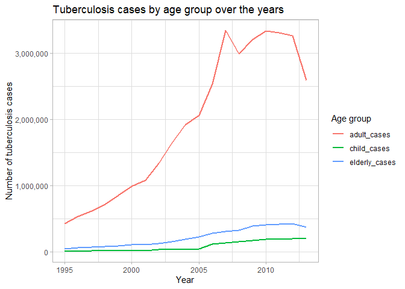
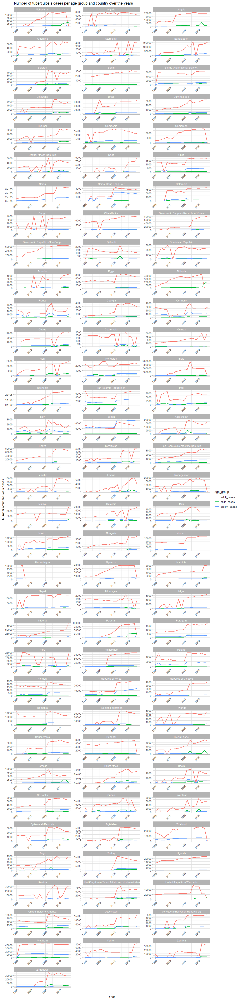

## Data

The dataset contains information on the reported tuberculosis cases in
three age groups: children, adults and elders in different countries
over the years. It consists of 3800 observations described by:  
- country - country where the tuberculosis cases were reported  
- year - year of the reported tuberculosis cases  
- sex - gender of the reported patients with tuberculosis  
- child - number of new cases reported among chldren (0 - 14 years
old)  
- adult - number of new cases reported among adults (15 - 64 years
old)  
- elderly - number of new cases reported among elders (over 64 years
old).  
The observations were reported from 1995 to 2013 in 100 different
countries.

    knitr::kable(summary(tb))

<table style="width:100%;">
<colgroup>
<col style="width: 3%" />
<col style="width: 17%" />
<col style="width: 13%" />
<col style="width: 17%" />
<col style="width: 16%" />
<col style="width: 15%" />
<col style="width: 17%" />
</colgroup>
<thead>
<tr class="header">
<th style="text-align: left;"></th>
<th style="text-align: left;">country</th>
<th style="text-align: left;">year</th>
<th style="text-align: left;">sex</th>
<th style="text-align: left;">child</th>
<th style="text-align: left;">adult</th>
<th style="text-align: left;">elderly</th>
</tr>
</thead>
<tbody>
<tr class="odd">
<td style="text-align: left;"></td>
<td style="text-align: left;">Length:3800</td>
<td style="text-align: left;">Min. :1995</td>
<td style="text-align: left;">Length:3800</td>
<td style="text-align: left;">Min. : 0.0</td>
<td style="text-align: left;">Min. : 0</td>
<td style="text-align: left;">Min. : 0.0</td>
</tr>
<tr class="even">
<td style="text-align: left;"></td>
<td style="text-align: left;">Class :character</td>
<td style="text-align: left;">1st Qu.:1999</td>
<td style="text-align: left;">Class :character</td>
<td style="text-align: left;">1st Qu.: 25.0</td>
<td style="text-align: left;">1st Qu.: 1128</td>
<td style="text-align: left;">1st Qu.: 84.5</td>
</tr>
<tr class="odd">
<td style="text-align: left;"></td>
<td style="text-align: left;">Mode :character</td>
<td style="text-align: left;">Median :2004</td>
<td style="text-align: left;">Mode :character</td>
<td style="text-align: left;">Median : 76.0</td>
<td style="text-align: left;">Median : 2589</td>
<td style="text-align: left;">Median : 230.0</td>
</tr>
<tr class="even">
<td style="text-align: left;"></td>
<td style="text-align: left;">NA</td>
<td style="text-align: left;">Mean :2004</td>
<td style="text-align: left;">NA</td>
<td style="text-align: left;">Mean : 493.2</td>
<td style="text-align: left;">Mean : 10864</td>
<td style="text-align: left;">Mean : 1253.0</td>
</tr>
<tr class="odd">
<td style="text-align: left;"></td>
<td style="text-align: left;">NA</td>
<td style="text-align: left;">3rd Qu.:2009</td>
<td style="text-align: left;">NA</td>
<td style="text-align: left;">3rd Qu.: 264.5</td>
<td style="text-align: left;">3rd Qu.: 6706</td>
<td style="text-align: left;">3rd Qu.: 640.0</td>
</tr>
<tr class="even">
<td style="text-align: left;"></td>
<td style="text-align: left;">NA</td>
<td style="text-align: left;">Max. :2013</td>
<td style="text-align: left;">NA</td>
<td style="text-align: left;">Max. :25661.0</td>
<td style="text-align: left;">Max. :731540</td>
<td style="text-align: left;">Max. :125991.0</td>
</tr>
<tr class="odd">
<td style="text-align: left;"></td>
<td style="text-align: left;">NA</td>
<td style="text-align: left;">NA</td>
<td style="text-align: left;">NA</td>
<td style="text-align: left;">NA’s :396</td>
<td style="text-align: left;">NA’s :413</td>
<td style="text-align: left;">NA’s :413</td>
</tr>
</tbody>
</table>

    str(tb)

    ## tibble [3,800 × 6] (S3: tbl_df/tbl/data.frame)
    ##  $ country: chr [1:3800] "Afghanistan" "Afghanistan" "Afghanistan" "Afghanistan" ...
    ##  $ year   : int [1:3800] 1995 1995 1996 1996 1997 1997 1998 1998 1999 1999 ...
    ##  $ sex    : chr [1:3800] "female" "male" "female" "male" ...
    ##  $ child  : int [1:3800] NA NA NA NA 5 0 45 30 25 8 ...
    ##  $ adult  : int [1:3800] NA NA NA NA 96 26 1142 500 484 212 ...
    ##  $ elderly: int [1:3800] NA NA NA NA 1 0 20 41 8 8 ...

## Tuberculosis cases per gender

Overall there’s been almost twice more cases of tuberculosis among male
patients that female, as male patients are 64% of all cases from 1995 to
2013.

    illnesses_by_gender <- tb %>%
      group_by(sex) %>%
      summarise(total = sum(child, adult, elderly, na.rm = TRUE))
    knitr::kable(illnesses_by_gender, col.names = c("Gender", "Tuberculosis cases"))

<table>
<thead>
<tr class="header">
<th style="text-align: left;">Gender</th>
<th style="text-align: right;">Tuberculosis cases</th>
</tr>
</thead>
<tbody>
<tr class="odd">
<td style="text-align: left;">female</td>
<td style="text-align: right;">15656162</td>
</tr>
<tr class="even">
<td style="text-align: left;">male</td>
<td style="text-align: right;">27062807</td>
</tr>
</tbody>
</table>

If we look at the age groups separately, the results are similar. In
adults and elders groups there were more cases among men than women,
however when it comes to children there’s been about 7% more cases among
girls than boys.

    cases_by_gender_and_age <- tb %>%
      group_by(sex) %>%
      summarise(children = sum(child, na.rm = TRUE),
                adults = sum(adult, na.rm = TRUE),
                elderly = sum(elderly, na.rm = TRUE)) %>%
      pivot_longer(cols = c(children, adults, elderly), names_to = "age_group", values_to = "cases") %>%
      pivot_wider(names_from = age_group, values_from = cases)

    knitr::kable(cases_by_gender_and_age)

<table>
<thead>
<tr class="header">
<th style="text-align: left;">sex</th>
<th style="text-align: right;">children</th>
<th style="text-align: right;">adults</th>
<th style="text-align: right;">elderly</th>
</tr>
</thead>
<tbody>
<tr class="odd">
<td style="text-align: left;">female</td>
<td style="text-align: right;">869778</td>
<td style="text-align: right;">13485145</td>
<td style="text-align: right;">1301239</td>
</tr>
<tr class="even">
<td style="text-align: left;">male</td>
<td style="text-align: right;">809158</td>
<td style="text-align: right;">23310815</td>
<td style="text-align: right;">2942834</td>
</tr>
</tbody>
</table>

## Tuberculosis cases per age group over the years

    yearly_summary <- tb %>%
      group_by(year) %>%
      summarise(child_cases = sum(child, na.rm = TRUE),
                adult_cases = sum(adult, na.rm = TRUE),
                elderly_cases = sum(elderly, na.rm = TRUE)) %>%
      pivot_longer(cols = c(child_cases, adult_cases, elderly_cases),
                   names_to = "age_group",
                   values_to = "cases")

    ggplot(yearly_summary, aes(x = year, y = cases, color = age_group)) +
      geom_line(linewidth = 1) +
      labs(title = "Tuberculosis cases by age group over the years",
           x = "Year",
           y = "Number of tuberculosis cases",
           color = "Age group") +
      scale_y_continuous(labels = comma) +
      theme_light()

## Tuberculosis cases per age group and country over the years

    cases_per_age_and_country <- tb %>%
      group_by(country, year) %>%
      summarise(child_cases = sum(child, na.rm = TRUE),
                adult_cases = sum(adult, na.rm = TRUE),
                elderly_cases = sum(elderly, na.rm = TRUE),
                 .groups = "drop") %>%
      pivot_longer(cols = c(child_cases, adult_cases, elderly_cases), 
                   names_to = "age_group", 
                   values_to = "cases")

    ggplot(cases_per_age_and_country, aes(x = year, y = cases, color = age_group)) +
      geom_line(linewidth = 1) +
      labs(title = "Number of tuberculosis cases per age group and country over the years",
           x = "Year", y = "Number of tuberculosis cases") +
    facet_wrap(~ country, ncol = 3, scales = "free") +
      theme_light() +
    theme(
        axis.text.x = element_text(angle = 45, hjust = 1)
      )

